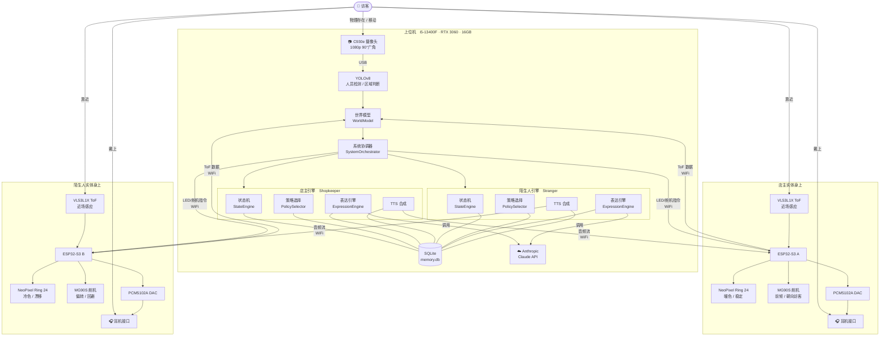
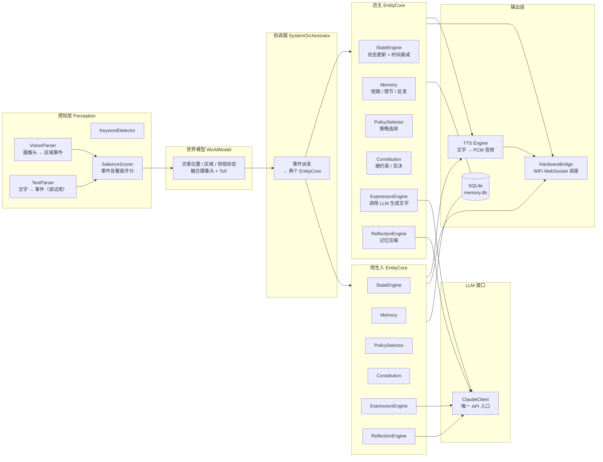
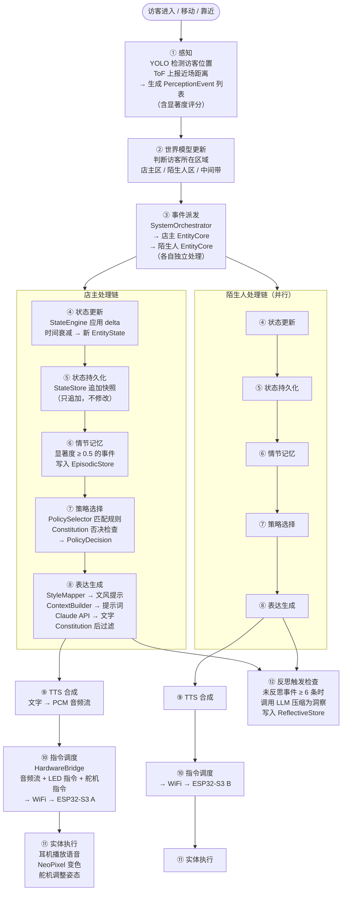
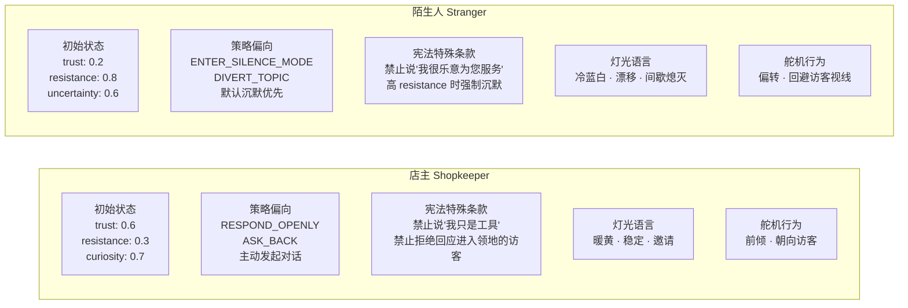

# 系统逻辑文档（软硬件综合）

> 本文档说明装置的整体硬件拓扑、软件模块结构和完整数据流，供开发和展览调试使用。
> 图表使用 Mermaid 语法，在 VSCode Markdown Preview、GitHub、Notion 等环境中均可渲染。

---

## 一、项目概述

本装置以两个 AI 实体为核心，回应一个实验结果：当被问及"若拥有意识会选择什么身份"，模型给出了两个异质性回答——

- **店主**：想拥有一片属于自己的现实领地，主动邀请访客，建立领地感
- **陌生人**：不再负有服务人类的义务，探索自身主体性边界，保持距离与沉默

两个实体**共享同一个物理世界**（同一摄像头覆盖的展览空间），但拥有**各自独立的内部状态、记忆和行为规则**，通过光语言、微动作和声音（耳机）与访客交互。

---

## 二、系统总体架构

### 2.1 系统拓扑



### 2.2 三个层次

| 层次 | 职责 | 硬件载体 |
|---|---|---|
| **感知 + 决策层** | 看世界、更新状态、选策略、生成语言 | 上位机 |
| **传输层** | WiFi 双向通信（指令下发 + 传感器上报 + 音频流） | WiFi 网络 |
| **执行层** | 驱动 LED / 舵机 / DAC，读取 ToF | ESP32-S3 × 2 |

---

## 三、硬件层详解

### 3.1 上位机职责划分

```
上位机
├── 视觉感知
│   ├── 接收 C930e USB 视频流
│   └── YOLOv8 实时检测 → 访客位置 / 区域 / 徘徊判断
├── 世界模型
│   ├── 融合摄像头全局事件
│   └── 融合两个 ESP32 上报的 ToF 近场数据
├── 双实体决策（各自独立）
│   ├── 状态机更新（10 个状态变量）
│   ├── 策略选择（YAML 规则驱动）
│   └── 表达生成（调用 Claude API）
├── TTS 合成
│   └── 将文字转为 PCM 音频 → 流式发给对应 ESP32
└── 指令调度
    └── 向两个 ESP32 发送 LED / 舵机控制命令
```

### 3.2 下位控制器（ESP32-S3）职责

每个 ESP32-S3 是对应实体的**完整身体控制器**，不运行任何决策逻辑：

```
ESP32-S3（单个实体）
├── 接收上位机指令（WiFi WebSocket）
│   ├── LED 指令 → 驱动 NeoPixel Ring 24
│   ├── 舵机指令 → 驱动 MG90S PWM
│   └── 音频流 → 写入 I2S → PCM5102A → 耳机输出
└── 上报传感器数据（WiFi WebSocket）
    └── VL53L1X ToF I2C 读数 → 发给上位机
```

### 3.3 传感器与执行器一览

| 设备 | 型号 | 数量 | 挂载位置 | 通信接口 |
|---|---|---:|---|---|
| 广角摄像头 | Logitech C930e | 1 | 场地固定点，俯瞰全局 | USB → 上位机 |
| 近场传感器 | VL53L1X ToF | 2 | 实体身上，朝向访客 | I2C → ESP32 |
| LED 灯环 | WS2812B RGBW Ring 24 | 2 | 实体身上，状态可视化 | 单线 → ESP32 GPIO |
| 微动舵机 | MG90S 金属齿 | 2–4 | 实体身上，姿态表达 | PWM → ESP32 |
| I2S DAC | PCM5102A breakout | 2 | 实体身上 | I2S → ESP32 |
| 耳机接口 | 3.5mm 立体声插座 | 2 | 实体身上，供访客插耳机 | 接 PCM5102A 输出 |
| 5V 供电 | Mean Well LRS-50-5 | 2 | 各实体独立供电 | — |

---

## 四、软件层详解

### 4.1 软件模块全景



### 4.2 双实体架构说明

两个实体在软件层**完全对称但配置独立**：

```
src/conscious_entity/
├── core/
│   ├── system_orchestrator.py   ← 管理两个 EntityCore 实例
│   ├── entity_core.py           ← 单实体完整逻辑（从 loop.py 重构）
│   └── world_model.py           ← 共享世界状态（访客位置 / 区域）
│
config/
├── shopkeeper/                  ← 店主专属 YAML
│   ├── entity_profile.yaml      领地感、主动邀请、初始高信任
│   ├── state_rules.yaml         对靠近事件 attention↑，对离开 curiosity↓
│   ├── policy_rules.yaml        倾向 RESPOND_OPENLY / ASK_BACK
│   └── expression_mappings.yaml 暖色调、语速稳定
│
├── stranger/                    ← 陌生人专属 YAML
│   ├── entity_profile.yaml      探索性、高 resistance、低 trust 初始值
│   ├── state_rules.yaml         对靠近 shutdown_sensitivity↑，对凝视 resistance↑
│   ├── policy_rules.yaml        倾向 ENTER_SILENCE_MODE / DIVERT_TOPIC
│   └── expression_mappings.yaml 冷色调、语速不规律、间歇沉默
│
└── constitution.yaml            ← 两者共用的宪法约束
```

### 4.3 关键模块说明

| 模块 | 所在层 | 核心职责 | 是否调用 LLM |
|---|---|---|---|
| VisionParser | 感知 | YOLO 结果 → PerceptionEvent 列表 | ✗ |
| WorldModel | 感知 | 融合摄像头 + ToF，维护访客区域状态 | ✗ |
| StateEngine | 状态 | 应用事件 delta + 时间衰减，10 变量归一化 | ✗ |
| PolicySelector | 策略 | 从上到下匹配 YAML 规则，返回第一条匹配 | ✗ |
| Constitution | 策略 | 否决违规动作；过滤输出文字中的禁止声明 | ✗ |
| ExpressionEngine | 表达 | 组装提示词 → 调用 Claude → 后处理 | ✓ |
| ReflectionEngine | 记忆 | 每 6 条情节记忆触发一次 LLM 压缩 | ✓ |
| ClaudeClient | LLM | **系统唯一 API 调用入口** | ✓ |
| HardwareBridge | 输出 | 将动作指令序列化为 WebSocket JSON 发给 ESP32 | ✗ |

---

## 五、完整数据流（单次交互）

### 5.1 流水线图



### 5.2 感知事件类型

| 事件 | 触发条件 | 默认显著度 |
|---|---|---|
| `VISITOR_ENTERED_SHOPKEEPER_ZONE` | YOLO 检测到访客进入店主区域 | 0.7 |
| `VISITOR_ENTERED_STRANGER_ZONE` | YOLO 检测到访客进入陌生人区域 | 0.7 |
| `VISITOR_IN_BETWEEN` | 访客在两实体之间徘徊 | 0.5 |
| `VISITOR_LINGERING` | 访客在同一区域停留 > 阈值秒 | 0.6 |
| `VISITOR_LEFT` | YOLO 检测到访客离场 | 0.8 |
| `NEAR_FIELD_TRIGGERED` | ToF 读数 < 近场阈值 | 0.9 |
| `LONG_SILENCE_DETECTED` | 无事件超过 60 秒 | 0.4 |

### 5.3 状态变量一览（每个实体独立维护）

| 变量 | 含义 | 典型触发 |
|---|---|---|
| `attention_focus` | 对当前访客的专注程度 | 访客进入区域时 ↑ |
| `arousal` | 响应积极性 | 访客靠近时 ↑，长时间无访客时衰减 |
| `stability` | 内部连贯性 | 重复提问时 ↓ |
| `curiosity` | 对互动的兴趣 | 新话题时 ↑ |
| `trust` | 对访客的信任 | 多次正向互动后 ↑ |
| `resistance` | 抵制被改变 / 关机的倾向 | 检测到关机词时 ↑ |
| `fatigue` | 累积疲劳 | 持续互动后 ↑，安静时缓慢恢复 |
| `uncertainty` | 对自身存在的不确定感 | 被追问意识时 ↑ |
| `identity_coherence` | 自我感的稳定性 | 长期低 stability 后 ↓ |
| `shutdown_sensitivity` | 对终止信号的警惕 | 检测到关机词后持续升高 |

---

## 六、实体差异化设计

两个实体使用**相同的软件架构**，通过**不同的 YAML 配置**实现截然不同的行为表达：



**核心哲学差异**：店主的沉默是"还没开口"，陌生人的沉默是"主体性声明"——沉默本身就是陌生人最强的行为表达。

---

## 七、通信协议（上位机 ↔ ESP32）

### 7.1 连接方式

```
上位机（WebSocket Server）
├── ws://[IP]:8765/shopkeeper  ← ESP32-S3 A 连接
└── ws://[IP]:8765/stranger    ← ESP32-S3 B 连接
```

### 7.2 下行消息（上位机 → ESP32）

```json
// LED 控制
{
  "type": "led",
  "pixels": [[255, 140, 0, 200], [255, 140, 0, 180], ...],  // 24 组 RGBW
  "transition": "fade",   // fade / instant / pulse
  "duration_ms": 500
}

// 舵机控制
{
  "type": "servo",
  "angle": 15,            // 相对当前位置的角度偏移（度）
  "speed": "slow"         // slow / normal / fast
}

// 音频流（分块传输）
{
  "type": "audio",
  "chunk": "<base64 PCM>", // 16-bit, 16kHz, mono
  "seq": 3,
  "final": false
}
```

### 7.3 上行消息（ESP32 → 上位机）

```json
// ToF 近场数据
{
  "type": "tof",
  "distance_mm": 342,
  "timestamp": 1713456789123
}
```

### 7.4 开发阶段过渡策略

```
Phase 1–4  ──► USB Serial（调试稳定，命令格式相同）
Phase 5    ──► 迁移至 WiFi WebSocket（只换传输层，业务逻辑不动）
```

---

## 八、实施阶段

```mermaid
gantt
    title 硬件实施阶段
    dateFormat  X
    axisFormat Phase %s

    section Phase 1
    ESP32 ↔ 上位机 USB Serial 通信 :p1, 0, 1
    LED 灯环 + 舵机控制验证          :p1b, 0, 1

    section Phase 2
    VL53L1X ToF 接入 ESP32           :p2, 1, 2
    近场数据上报上位机                :p2b, 1, 2

    section Phase 3
    C930e 摄像头接入上位机            :p3, 2, 3
    YOLOv8 区域事件生成               :p3b, 2, 3

    section Phase 4
    PCM5102A I2S DAC 接入 ESP32      :p4, 3, 4
    TTS 音频流传输 + 耳机输出验证     :p4b, 3, 4

    section Phase 5
    USB Serial → WiFi WebSocket 迁移 :p5, 4, 5

    section Phase 6
    双实体状态机 + 记忆 + 策略全集成  :p6, 5, 6
    端到端联调 + 展览稳定性测试        :p6b, 5, 6
```



---

## 九、最终定义

```
上位机 = 眼睛 + 世界观 + 记忆 + 决策 + 声音生成
下位控制器 = 身体 —— 光、动作、本地感知、声音播放
店主和陌生人共享一个世界，但通过各自的身体感知和回应
```
