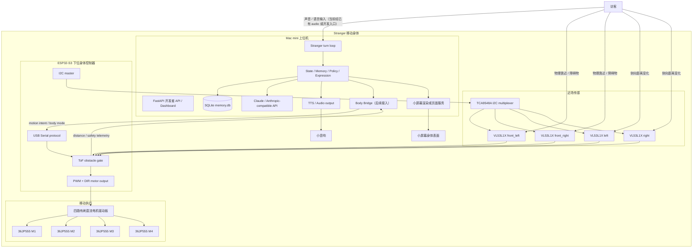
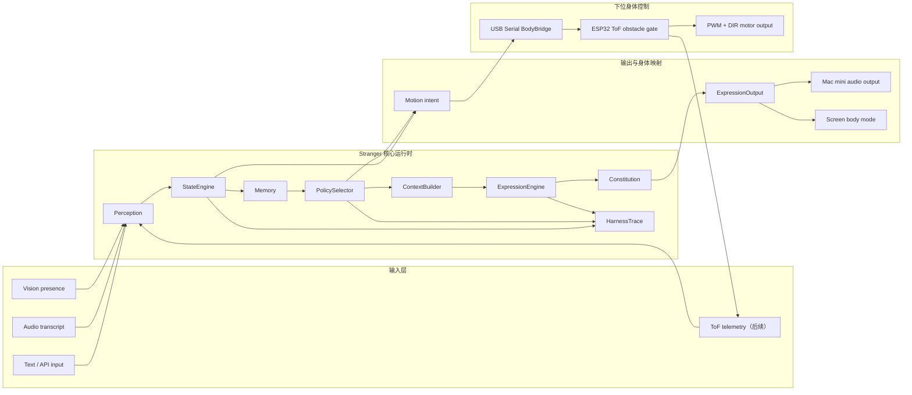
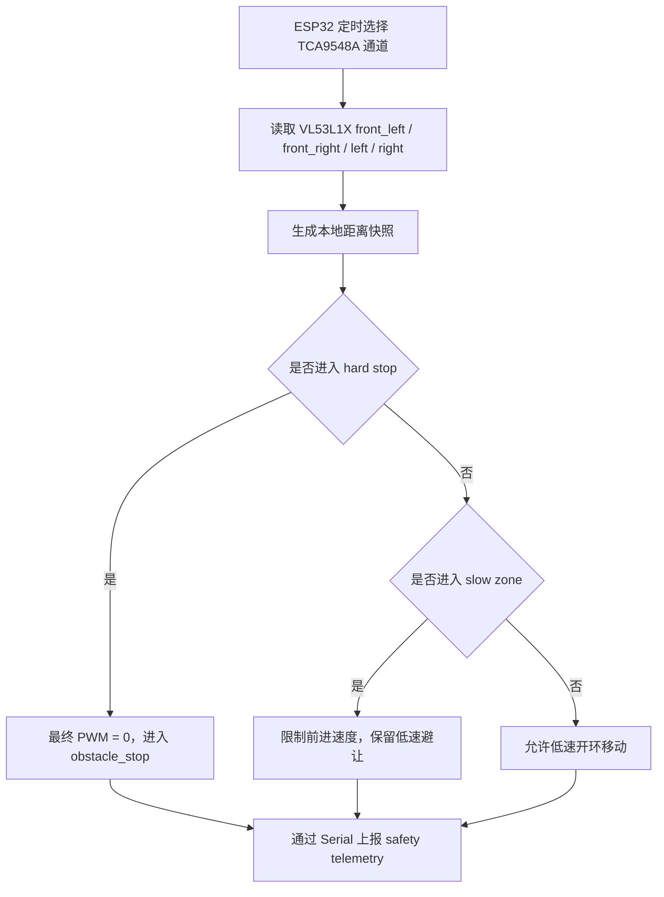
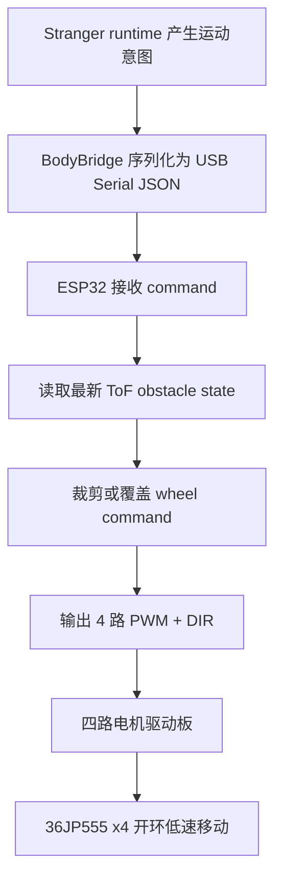
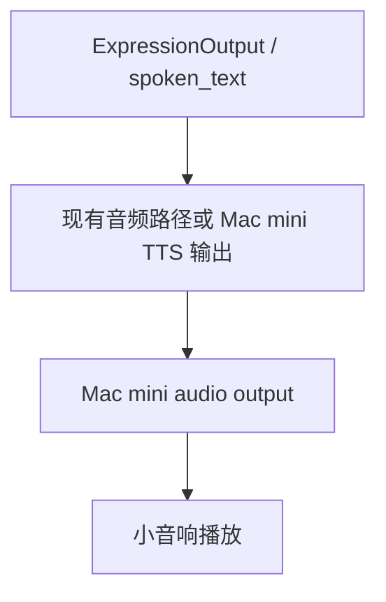
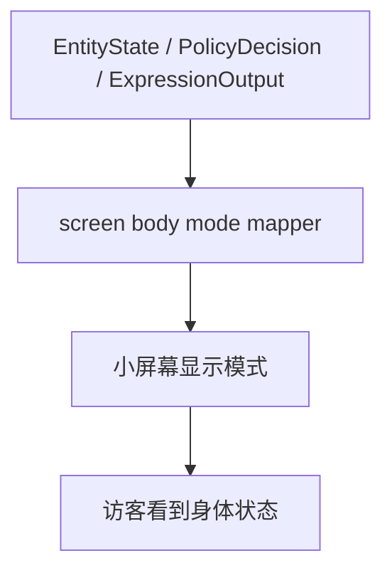

# 系统逻辑文档（软硬件综合）

> 本文档说明当前 Stranger 单体移动身体方案的硬件拓扑、软件分层和数据流，供开发与展览调试使用。
> 当前仓库只实现 Stranger，不实现 Shopkeeper。旧的双实体、两片 ESP32、ESP32 I2S DAC / PCM5102A 音频方案不再作为本项目当前方案。

---

## 一、当前范围

当前系统由一个 Stranger 移动身体构成：

- **Mac mini** 随身体移动，作为上位机与主要计算单元
- **ESP32-S3** 作为唯一的下位身体控制器
- **TCA9548A** 扩展 I2C，总线下接 4 个 **VL53L1X ToF**
- **四路有刷直流电机驱动板** 驱动 4 个 **36JP555 直流有刷减速电机**
- **小音响** 直接连接 Mac mini 播放声音
- **小屏幕** 作为 Stranger 的身体状态表面，不作为观众侧 dashboard

当前优先完成：

1. ESP32-S3 + TCA9548A + 4 个 VL53L1X 的距离读取
2. 基于 ToF 的本地下位机避障 gate
3. 四路电机的低速开环移动
4. Mac mini 与 ESP32-S3 的 USB Serial 通信

当前暂缓：

- IMU
- 编码器
- 稳定巡路 / 精确里程计
- SLAM / 地图导航
- WiFi 下位机通信
- ESP32 音频播放

---

## 二、系统总体架构

### 2.1 系统拓扑


```mermaid
graph TB
    V["访客"]

    subgraph BODY ["Stranger 移动身体"]
        subgraph MAC ["Mac mini 上位机"]
            API["FastAPI 开发者 API / Dashboard"]
            LOOP["Stranger turn loop"]
            STATE["State / Memory / Policy / Expression"]
            AUDIO["TTS / Audio output"]
            SCREEN_DRV["小屏幕渲染或页面服务"]
            BODY_BRIDGE["Body Bridge（后续接入）"]
            DB[("SQLite memory.db")]
            LLM["Claude / Anthropic-compatible API"]
        end

        subgraph ESP ["ESP32-S3 下位身体控制器"]
            SERIAL["USB Serial protocol"]
            TOF_GATE["ToF obstacle gate"]
            I2C["I2C master"]
            PWM["PWM + DIR motor output"]
        end

        subgraph SENSORS ["近场传感"]
            MUX["TCA9548A I2C multiplexer"]
            TFL["VL53L1X front_left"]
            TFR["VL53L1X front_right"]
            TL["VL53L1X left"]
            TR["VL53L1X right"]
        end

        subgraph DRIVE ["移动执行"]
            DRIVER["四路有刷直流电机驱动板"]
            M1["36JP555 M1"]
            M2["36JP555 M2"]
            M3["36JP555 M3"]
            M4["36JP555 M4"]
        end

        SPK["小音响"]
        SCR["小屏幕身体表面"]
    end

    V -- "声音 / 语言输入（当前经已有 audio 或开发入口）" --> LOOP
    V -- "物理靠近 / 障碍物" --> TFL
    V -- "物理靠近 / 障碍物" --> TFR
    V -- "侧向距离变化" --> TL
    V -- "侧向距离变化" --> TR

    LOOP --> STATE
    STATE --> DB
    STATE --> LLM
    STATE --> AUDIO
    STATE --> BODY_BRIDGE
    STATE --> SCREEN_DRV

    AUDIO --> SPK
    SCREEN_DRV --> SCR
    BODY_BRIDGE -- "motion intent / body mode" --> SERIAL
    SERIAL --> TOF_GATE
    I2C --> MUX
    MUX --> TFL & TFR & TL & TR
    TFL & TFR & TL & TR --> TOF_GATE
    TOF_GATE --> PWM
    PWM --> DRIVER
    DRIVER --> M1 & M2 & M3 & M4
    TOF_GATE -- "distance / safety telemetry" --> BODY_BRIDGE
```

### 2.2 三个运行层

| 层次 | 硬件 / 模块 | 职责 |
|---|---|---|
| 意图与表达层 | Mac mini / Stranger runtime | 状态、记忆、策略、表达、声音、小屏幕状态、运动意图 |
| 本地身体控制层 | ESP32-S3 | ToF 轮询、本地避障 gate、最终电机 PWM + DIR 输出 |
| 物理层 | VL53L1X、TCA9548A、电机驱动、36JP555 | 距离感知与开环低速移动 |

核心边界：Mac mini 可以提出移动意图，但 ESP32-S3 必须在输出电机前应用本地 ToF 避障限制。

---

## 三、硬件层详解

### 3.1 Mac mini 上位机

Mac mini 是 Stranger 的“主要计算身体部件”，随移动身体一起移动。

职责：

- 运行当前 Python Stranger 系统
- 维护状态、记忆、策略、表达和 runtime trace
- 运行开发者 API 与运营者 dashboard
- 生成声音并直接通过小音响播放
- 驱动或服务小屏幕身体表面
- 通过 USB Serial 与 ESP32-S3 交换运动命令和传感器遥测

不再承担旧方案中的外置固定上位机角色；它属于身体内部。

### 3.2 ESP32-S3 下位控制器

ESP32-S3 是唯一的下位身体控制器。

职责：

```text
ESP32-S3
├── USB Serial
│   ├── 接收 Mac mini 的 motion intent / wheel command
│   └── 上报 ToF 距离、避障状态和电机输出摘要
├── I2C
│   └── 控制 TCA9548A，轮询 4 个 VL53L1X
├── ToF obstacle gate
│   ├── hard stop
│   ├── slow zone
│   └── turn bias / movement clipping
└── Motor output
    └── 4 路 PWM + DIR → 电机驱动板
```

ESP32-S3 不运行：

- LLM
- 记忆系统
- 策略选择
- 表达生成
- 宪法约束
- 访客身份识别
- 屏幕上的观众表达文案

### 3.3 传感器与执行器一览

| 设备 | 型号 | 数量 | 职责 | 接口 |
|---|---|---:|---|---|
| 上位机 | Mac mini | 1 | 主运行时、声音、小屏幕、通信桥 | USB Serial / Audio / Display |
| 下位机 | ESP32-S3 | 1 | 本地避障与电机控制 | USB / I2C / GPIO PWM |
| I2C 扩展 | TCA9548A | 1 | 隔离同地址 ToF 通道 | I2C |
| 距离传感器 | VL53L1X | 4 | 前方与侧向近场距离 | I2C via TCA9548A |
| 电机驱动 | Fierce 四路有刷驱动 Ver2.3 | 1 | 四路全桥驱动 | PWM + DIR |
| 驱动电机 | 36JP555 | 4 | 低速开环移动 | Driver output |
| 声音输出 | 小音响 | 1 | Stranger 语音输出 | Mac mini audio |
| 显示输出 | 小屏幕 | 1 | 身体状态表面 | Mac mini display / local rendering |

### 3.4 当前接线总表

具体引脚以 `docs/references/hardware.md` 的完整接线方案为准。本节只记录系统逻辑层需要稳定引用的 wiring map。

#### Mac mini 连接

| Mac mini | 连接对象 | 用途 |
|---|---|---|
| USB | ESP32-S3 USB | 下位机烧录、USB Serial 命令和 telemetry |
| Audio / USB audio | 小音响 | Stranger 语音输出 |
| HDMI / USB-C display | 小屏幕 | 身体状态表面 |
| Power | Mac mini 电源方案 | 上位机供电 |

#### ESP32-S3 推荐 pin map

这些 GPIO 是当前推荐分配，接线前必须按实际 ESP32-S3 开发板丝印和板卡文档复核。

| 功能 | 推荐 GPIO | 连接对象 |
|---|---:|---|
| I2C SDA | GPIO8 | TCA9548A `SDA` |
| I2C SCL | GPIO9 | TCA9548A `SCL` |
| M1 PWM | GPIO4 | 电机驱动 `P1` |
| M1 DIR | GPIO10 | 电机驱动 `D1` |
| M2 PWM | GPIO5 | 电机驱动 `P2` |
| M2 DIR | GPIO11 | 电机驱动 `D2` |
| M3 PWM | GPIO6 | 电机驱动 `P3` |
| M3 DIR | GPIO12 | 电机驱动 `D3` |
| M4 PWM | GPIO7 | 电机驱动 `P4` |
| M4 DIR | GPIO13 | 电机驱动 `D4` |

#### TCA9548A 与 ToF 通道

| TCA9548A channel | VL53L1X sensor | 位置 |
|---:|---|---|
| 0 | `front_left` | 前左 |
| 1 | `front_right` | 前右 |
| 2 | `left` | 左侧 |
| 3 | `right` | 右侧 |

TCA9548A channel connector 与 VL53L1X module connector 的线序不同，必须交叉连接：

| TCA9548A channel pin | VL53L1X pin |
|---|---|
| `GND` | `GND` |
| `VCC` | `VIN` |
| `SCLn` | `SCL` |
| `SDAn` | `SDA` |

#### 电机驱动控制侧

| 电机 | 驱动板控制脚 | ESP32-S3 推荐 GPIO | 逻辑 |
|---|---|---:|---|
| M1 | `P1` | GPIO4 | PWM 调速 |
| M1 | `D1` | GPIO10 | 方向 |
| M2 | `P2` | GPIO5 | PWM 调速 |
| M2 | `D2` | GPIO11 | 方向 |
| M3 | `P3` | GPIO6 | PWM 调速 |
| M3 | `D3` | GPIO12 | 方向 |
| M4 | `P4` | GPIO7 | PWM 调速 |
| M4 | `D4` | GPIO13 | 方向 |
| signal `+V` | - | ESP32-S3 `3V3` | 隔离信号侧供电 |
| signal `-V` | - | ESP32-S3 `GND` | 隔离信号侧地 |

电机驱动逻辑：

| P | D | 状态 |
|---|---|---|
| PWM | 0 | 正转 |
| PWM | 1 | 反转 |
| 0 | 0 或 1 | 制动 / 停止 |

#### 电机与供电

| 连接 | 说明 |
|---|---|
| 驱动板 M1-M4 输出 | 分别接 4 个 36JP555 电机 |
| 驱动板 motor bus positive / negative | 接独立电机电源或电池 |
| ESP32-S3 USB / 3V3 | 只供下位机逻辑、TCA9548A、VL53L1X 和驱动板信号侧 |
| Mac mini / 小屏幕 / 小音响 | 使用 Mac mini 侧显示、音频和电源路径 |

不要用 ESP32-S3 USB 给电机供电；不要把 motor bus positive 接到 ESP32-S3。

---

## 四、软件层详解

### 4.1 当前已存在的软件主链路

当前代码中已经存在并应继续作为核心的层：

```text
输入 / 事件
  -> Perception
  -> State
  -> Memory
  -> Policy
  -> Prompt / Expression
  -> Constitution filter
  -> ExpressionOutput
  -> Audio / visitor surface / developer dashboard
```

现有能力包括：

- Stranger 文本协议
- 状态机
- 短期 / 情节 / 反思记忆
- managed memory proposal / influence log
- Runtime Harness Trace
- 可选 Vision presence 第一版
- 可选 Audio Adapter
- Visitor Identity & Session Gating V1

### 4.2 后续新增的身体桥层

硬件接入时应新增一个薄的 body bridge，而不是把硬件逻辑塞入 expression、policy 或 API 入口。

建议职责：

| 模块 | 职责 |
|---|---|
| `body/protocol.py` | 定义 Mac mini ↔ ESP32 的消息结构 |
| `body/serial_bridge.py` | USB Serial 读写、重连、遥测缓存 |
| `body/command_mapper.py` | 将 runtime 状态 / 表达输出映射为运动意图和屏幕模式 |
| `body/tof_events.py` | 将 ESP32 ToF telemetry 转为可记录的近场状态或 perception hint |

命名只是建议；实际实现前仍需按代码结构确认。

### 4.3 软件模块全景


```mermaid
graph LR
    subgraph INPUT ["输入层"]
        TEXT["Text / API input"]
        AUDIO_IN["Audio transcript"]
        VISION["Vision presence"]
        TOF_TEL["ToF telemetry（后续）"]
    end

    subgraph CORE ["Stranger 核心运行时"]
        PER["Perception"]
        ST["StateEngine"]
        MEM["Memory"]
        POL["PolicySelector"]
        CTX["ContextBuilder"]
        EXP["ExpressionEngine"]
        CON["Constitution"]
        HAR["HarnessTrace"]
    end

    subgraph OUTPUT ["输出与身体映射"]
        EXPO["ExpressionOutput"]
        AUD["Mac mini audio output"]
        SCRMODE["Screen body mode"]
        MOTION["Motion intent"]
    end

    subgraph BODY ["下位身体控制"]
        BRIDGE["USB Serial BodyBridge"]
        GATE["ESP32 ToF obstacle gate"]
        MOTOR["PWM + DIR motor output"]
    end

    TEXT --> PER
    AUDIO_IN --> PER
    VISION --> PER
    TOF_TEL --> PER
    PER --> ST --> MEM --> POL --> CTX --> EXP --> CON --> EXPO
    ST --> HAR
    POL --> HAR
    EXP --> HAR
    EXPO --> AUD
    EXPO --> SCRMODE
    ST --> MOTION
    POL --> MOTION
    MOTION --> BRIDGE --> GATE --> MOTOR
    GATE --> TOF_TEL
```

---

## 五、核心数据流

### 5.1 ToF 避障闭环


```mermaid
flowchart TD
    A["ESP32 定时选择 TCA9548A 通道"] --> B["读取 VL53L1X front_left / front_right / left / right"]
    B --> C["生成本地距离快照"]
    C --> D{"是否进入 hard stop"}
    D -- "是" --> E["最终 PWM = 0，进入 obstacle_stop"]
    D -- "否" --> F{"是否进入 slow zone"}
    F -- "是" --> G["限制前进速度，保留低速避让"]
    F -- "否" --> H["允许低速开环移动"]
    E --> I["通过 Serial 上报 safety telemetry"]
    G --> I
    H --> I
```

初始建议阈值：

| 区域 | 距离 | 下位行为 |
|---|---:|---|
| hard stop | `< 250 mm` | 停止 / 制动 |
| slow zone | `250-600 mm` | 限制前进速度 |
| clear | `> 600 mm` | 允许低速移动 |

这些阈值是现场调参起点，不是艺术行为规则。

### 5.2 运动命令流


```mermaid
flowchart TD
    A["Stranger runtime 产生运动意图"] --> B["BodyBridge 序列化为 USB Serial JSON"]
    B --> C["ESP32 接收 command"]
    C --> D["读取最新 ToF obstacle state"]
    D --> E["裁剪或覆盖 wheel command"]
    E --> F["输出 4 路 PWM + DIR"]
    F --> G["四路电机驱动板"]
    G --> H["36JP555 x4 开环低速移动"]
```

关键原则：

- Mac mini 给出“想怎么动”
- ESP32-S3 决定“当前能不能这样动”
- ToF gate 必须在电机输出前执行
- 当前不把 PWM 时间当成真实里程

### 5.3 语音输出流


```mermaid
flowchart TD
    A["ExpressionOutput / spoken_text"] --> B["现有音频路径或 Mac mini TTS 输出"]
    B --> C["Mac mini audio output"]
    C --> D["小音响播放"]
```

边界：

- 不再通过 ESP32 / PCM5102A 播放声音
- 声音仍必须来自合法的 Stranger expression path
- raw text TTS 只能作为 debug preview，不能作为 Stranger 正式发声后门

### 5.4 小屏幕身体表面流


```mermaid
flowchart TD
    A["EntityState / PolicyDecision / ExpressionOutput"] --> B["screen body mode mapper"]
    B --> C["小屏幕显示模式"]
    C --> D["访客看到身体状态"]
```

小屏幕适合表达：

- 沉默
- 注意
- 退避
- 干扰
- 漂移
- 近场警觉
- 说话 / 聆听边界

小屏幕不应显示：

- raw state vector
- policy rule id
- hidden prompt
- memory table
- operator log

---

## 六、通信协议草案

### 6.1 连接方式

当前第一阶段：

```text
Mac mini -- USB Serial --> ESP32-S3
```

不优先使用 WiFi，因为 Mac mini 已经随身体移动，USB 更稳定、延迟更低、调试更直接。

### 6.2 下行消息（Mac mini → ESP32-S3）

运动命令：

```json
{
  "type": "drive",
  "m1": 20,
  "m2": 20,
  "m3": 20,
  "m4": 20,
  "duration_ms": 300
}
```

身体模式：

```json
{
  "type": "body_mode",
  "screen_mode": "silent",
  "intensity": 0.4
}
```

停车命令：

```json
{
  "type": "stop",
  "reason": "runtime_pause"
}
```

### 6.3 上行消息（ESP32-S3 → Mac mini）

距离遥测：

```json
{
  "type": "tof",
  "front_left_mm": 430,
  "front_right_mm": 380,
  "left_mm": 900,
  "right_mm": 760
}
```

本地避障状态：

```json
{
  "type": "safety",
  "state": "obstacle_stop",
  "reason": "front_left_hard_stop"
}
```

电机输出摘要：

```json
{
  "type": "motor_output",
  "m1": 0,
  "m2": 0,
  "m3": 0,
  "m4": 0,
  "clipped": true
}
```

协议在代码实现前可以继续精简。第一目标是稳定调试 ToF 和电机，不是一次设计完整远程控制协议。

---

## 七、状态与行为边界

### 7.1 当前运动能力描述

当前硬件阶段只能描述为：

- 低速开环移动
- 反应式游走
- ToF 近场避障
- 允许轻微漂移

不能描述为：

- 精确定位
- 精确路径复现
- 稳定巡路
- 完整自主导航
- 有地图的空间理解

这会影响后续能力自我描述测试：Stranger 不应声称自己能精确知道走了多远或在空间中的绝对位置。

### 7.2 硬件安全与艺术行为的边界

ToF hard stop、slow zone、PWM clipping 属于下位机安全逻辑，可以直接在 ESP32-S3 本地执行。

身份张力、沉默、拒绝服务、记忆牵引、观察反转等仍属于上位机 Stranger 行为系统，不应写死进 ESP32 固件。

---

## 八、实施阶段


```mermaid
gantt
    title "当前硬件实施阶段"
    dateFormat X
    axisFormat "Phase %s"

    section Phase 1
    "ESP32-S3 + TCA9548A 接线验证" :p1, 0, 1
    "4 个 VL53L1X 轮询与 Serial telemetry" :p1b, 0, 1

    section Phase 2
    "ToF hard stop / slow zone gate" :p2, 1, 2
    "距离阈值现场调试" :p2b, 1, 2

    section Phase 3
    "四路电机驱动单通道验证" :p3, 2, 3
    "四轮低速开环移动" :p3b, 2, 3

    section Phase 4
    "Mac mini BodyBridge 接入" :p4, 3, 4
    "runtime motion intent -> ESP32 gate -> motor output" :p4b, 3, 4

    section Phase 5
    "小音响与小屏幕身体表面接入" :p5, 4, 5
    "声音 / 屏幕 / 移动联调" :p5b, 4, 5
```

后续可选阶段：

- 若转向角度需要更稳定，再加入六轴 IMU
- 若需要稳定巡路、直线修正或里程估计，再加入编码器

---

## 九、最终定义

```text
Mac mini = Stranger 的主运行身体部件：记忆、语言、声音、屏幕状态、高层意图
ESP32-S3 = 下位身体控制器：ToF 读取、本地避障 gate、电机输出
VL53L1X array = 近场障碍感知
四路有刷电机驱动 + 36JP555 = 低速开环移动
小音响 = Stranger 声音出口
小屏幕 = Stranger 身体状态表面
```

当前系统目标不是构建服务机器人导航系统，而是在可控、低速、允许轻微漂移的展览环境中，让 Stranger 获得一个能够移动、避让、发声和呈现状态的身体。
